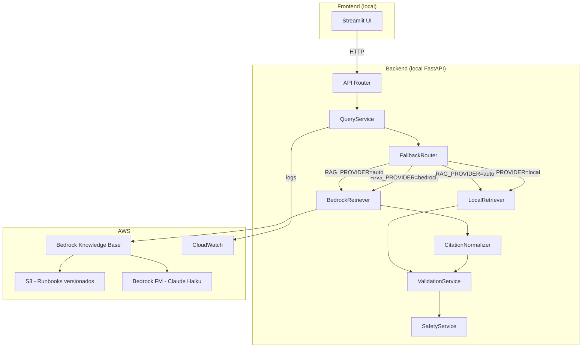

# Design — AWS Evolution (Runbook Guardian)

## Arquitectura híbrida



## Abstracción de proveedor RAG

### Protocol (interfaz común)

```python
from typing import Protocol

class RunbookRetriever(Protocol):
    def retrieve(self, query: str, top_k: int = 5) -> RetrievalResult:
        """Recupera fragmentos relevantes del corpus de runbooks."""
        ...
```

### Implementaciones

| Clase | Proveedor | Dependencias |
|-------|-----------|-------------|
| `LocalRunbookRetriever` | ChromaDB + sentence-transformers | Funcional (existente) |
| `BedrockRunbookRetriever` | Bedrock Knowledge Bases | boto3, AWS credentials |
| `FallbackRouter` | auto-switch entre ambos | Ambos retrievers |

### Routing por provider

```python
RAG_PROVIDER = "local" | "bedrock" | "auto"
```

- `local`: Usa exclusivamente LocalRunbookRetriever (comportamiento actual).
- `bedrock`: Usa BedrockRunbookRetriever. Si falla → error controlado (no fallback).
- `auto`: Intenta Bedrock. Si falla → activa LocalRunbookRetriever + informa motivo.

## Modelo de respuesta extendido

```python
class QueryResponse(BaseModel):
    query: str
    results: list[EvidenceFragment]
    warnings: list[str]
    rejected_sources: list[RejectedSource]
    metadata: ResponseMetadata

class ResponseMetadata(BaseModel):
    response_time_ms: int
    total_candidates: int
    mode: str                    # "normal" | "fallback"
    provider_requested: str      # "local" | "bedrock" | "auto"
    provider_used: str           # "local" | "bedrock"
    fallback_applied: bool
    fallback_reason: str | None  # "BEDROCK_TIMEOUT" | "BEDROCK_AUTH_ERROR" | etc.
    correlation_id: str
```

## CloudFormation — Stack principal

### Recursos del stack `runbook-guardian-dev`

| Recurso | Tipo CloudFormation | DeletionPolicy |
|---------|-------------------|---------------|
| S3 Bucket (runbooks) | `AWS::S3::Bucket` | Retain |
| S3 Bucket Policy | `AWS::S3::BucketPolicy` | Delete |
| IAM Role (Bedrock KB) | `AWS::IAM::Role` | Delete |
| IAM Role (Lambda, fase 2) | `AWS::IAM::Role` | Delete |
| Bedrock Knowledge Base | (Custom o manual*) | Delete |
| CloudWatch Log Group | `AWS::Logs::LogGroup` | Delete |

*Nota: A julio 2026, verificar si `AWS::Bedrock::KnowledgeBase` está soportado en CloudFormation. Si no, documentar creación manual o usar Custom Resource.*

### Parámetros

```yaml
Parameters:
  ProjectName:
    Type: String
    Default: runbook-guardian
  Environment:
    Type: String
    Default: dev
    AllowedValues: [dev, demo]
  BedrockModelId:
    Type: String
    Default: anthropic.claude-3-haiku-20240307-v1:0
  BedrockEmbeddingModelId:
    Type: String
    Default: amazon.titan-embed-text-v2:0
  LogRetentionDays:
    Type: Number
    Default: 7
```

### Outputs

```yaml
Outputs:
  S3BucketName:
    Value: !Ref RunbookSourceBucket
  S3BucketArn:
    Value: !GetAtt RunbookSourceBucket.Arn
  BedrockRoleArn:
    Value: !GetAtt BedrockKBRole.Arn
```

## S3 — Diseño del bucket

```
s3://runbook-guardian-source-{account-id}-dev/
├── runbooks/
│   ├── api-500-errors.md
│   ├── service-restart-nginx.md
│   └── ... (16 archivos)
└── manifests/
    └── runbook-manifest.json
```

Configuración:
- Versioning: Enabled.
- Block Public Access: All 4 options enabled.
- Encryption: SSE-S3.
- Lifecycle: Delete non-current versions after 30 days.

## Bedrock Knowledge Base — Diseño

### Estrategia de retrieval (evaluación de opciones)

**Opción A: Knowledge Base con vector store managed**
- Pro: Retrieval semántico completo, citaciones automáticas.
- Contra: Vector store (OpenSearch Serverless) tiene costo mínimo ~$0.24/hora por OCU.
- Costo estimado: ~$170/mes (2 OCUs mínimo). **DESCARTADA para MVP por costo.**

**Opción B: Knowledge Base con Pinecone free tier**
- Pro: Vector store gratuito (hasta 100K vectors).
- Contra: Dependencia externa, configuración adicional.
- Evaluación: Viable si se requiere KB.

**Opción C: RetrieveAndGenerate directo (sin Knowledge Base dedicada)**
- Pro: Sin vector store adicional. Usa S3 como fuente.
- Contra: Limitaciones en el retrieval. Requiere KB de todas formas.

**Opción D (RECOMENDADA para MVP económico): InvokeModel con contexto inline**
- Pro: $0 de costo fijo. Solo paga por tokens consumidos (~$0.002/query).
- Contra: Sin retrieval semántico en Bedrock (se usa el local para recuperar, Bedrock solo genera).
- Flujo: LocalRetriever busca fragmentos → Bedrock genera respuesta con esos fragmentos como contexto.

### Decisión para MVP

**Usar Opción D para la fase inicial:**
1. El LocalRetriever (ChromaDB) recupera los fragmentos relevantes.
2. Los fragmentos se envían como contexto a Claude Haiku vía `InvokeModel`.
3. Claude genera una respuesta sintetizada con los fragmentos como evidencia.
4. El pipeline determinista valida la respuesta antes de entregarla.

**Ventaja de costos:** $0 fijo + ~$0.002 por query (solo tokens).
**Si se necesita KB completa:** Implementar en fase posterior cuando se justifique el costo.

### Flujo para Opción D

```
Query → LocalRetriever (ChromaDB) → Top-5 fragmentos
    → Prompt engineering (fragmentos como contexto)
    → Bedrock InvokeModel (Claude Haiku)
    → Respuesta generada con citas inline
    → CitationNormalizer (extrae fuentes del texto)
    → ValidationService (vigencia)
    → SafetyService (destructivas)
    → Response
```

## Seguridad — Extensiones para AWS

### Patrones destructivos adicionales

```python
# Agregar a destructive_patterns.py
"aws\s+cloudformation\s+delete-stack",
"aws\s+s3\s+rb",
"aws\s+s3\s+rm.*--recursive",
"aws\s+iam\s+delete",
"aws\s+ec2\s+terminate",
"terraform\s+destroy",
"kubectl\s+delete\s+namespace",
"DROP\s+ALL\s+TABLES",
```

### Aprobación humana

Acciones que requieren `HUMAN_APPROVAL_REQUIRED`:
- Reinicio de cualquier servicio en producción.
- Eliminación de datos o recursos.
- Cambios en IAM o seguridad.
- Rollback de despliegue.
- Cualquier acción con `risk_level: high` en el runbook.

## CI/CD — GitHub Actions

### Workflows

| Workflow | Trigger | Acciones |
|----------|---------|----------|
| `pull-request.yml` | PR a develop/main | lint, test, cfn-lint, validate-template |
| `deploy-dev.yml` | Manual | Create change set, show changes, execute con aprobación |
| `delete-dev-stack.yml` | Manual | Delete stack con confirmación |

### OIDC

GitHub Actions se autentica con AWS vía OIDC (sin access keys permanentes):
```yaml
permissions:
  id-token: write
  contents: read
```

## Decisiones técnicas

| Decisión | Justificación | Alternativa descartada |
|----------|---------------|----------------------|
| InvokeModel directo (no KB) | $0 costo fijo, MVP suficiente | KB + OpenSearch ($170/mes) |
| Claude Haiku | Más económico de Claude | Sonnet (10x costo) |
| Titan Embed v2 | Más económico, nativo AWS | Cohere (más caro) |
| Un solo stack CFN | Simplicidad MVP | Nested stacks (innecesario) |
| SSE-S3 | Sin costo adicional | KMS ($1/mes + requests) |
| OIDC para CI/CD | Sin credentials permanentes | Access keys (inseguro) |
| LocalRetriever primero | Ya funciona, Bedrock solo mejora | Reemplazar local (viola principios) |
