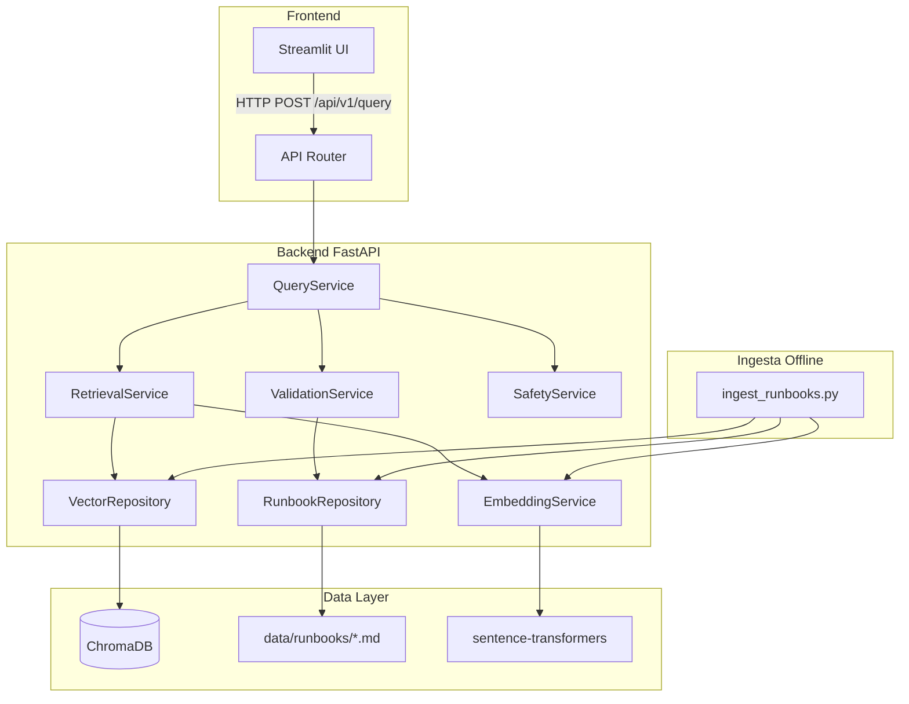

# Design — Core MVP (Runbook Guardian)

## Arquitectura general



## Componentes

### 1. API Layer (`backend/api/`)

**router.py** — Endpoints REST:
- `POST /api/v1/query` — Recibe consulta, retorna resultados con evidencia.
- `GET /api/v1/health` — Estado del sistema y conteo de runbooks.
- `GET /api/v1/runbooks` — Lista de runbooks indexados (metadata).

**schemas.py** — Modelos Pydantic:
```python
class QueryRequest(BaseModel):
    query: str = Field(..., min_length=1, max_length=500)

class EvidenceFragment(BaseModel):
    text: str
    source_file: str
    version: str
    last_reviewed: date
    section: str
    similarity_score: float
    warnings: list[str] = []

class RejectedSource(BaseModel):
    source_file: str
    reason: str  # "deprecated" | "stale" | "missing_metadata"

class QueryResponse(BaseModel):
    query: str
    results: list[EvidenceFragment]
    warnings: list[str]
    rejected_sources: list[RejectedSource]
    metadata: ResponseMetadata

class ResponseMetadata(BaseModel):
    response_time_ms: int
    total_candidates: int
    mode: str  # "normal" | "fallback"
```

### 2. Service Layer (`backend/services/`)

**query_service.py** — Orquestador principal:
```
query → RetrievalService.search(query)
     → ValidationService.filter_valid(candidates)
     → SafetyService.check_fragments(valid_results)
     → build_response(checked_results)
```

**retrieval_service.py** — Búsqueda semántica:
- Genera embedding de la query usando sentence-transformers.
- Busca top-k=5 en ChromaDB.
- Retorna candidatos con metadata y score.

**validation_service.py** — Validación de vigencia:
- Verifica `status != deprecated`.
- Verifica `last_reviewed` dentro de los últimos 90 días.
- Verifica campos obligatorios de metadata.
- Retorna lista de válidos + lista de rechazados con motivo.

**safety_service.py** — Detección de acciones destructivas:
- Lista determinista de patrones regex.
- Para cada fragmento, escanea patrones.
- Si encuentra match: agrega WARNING al fragmento (no lo elimina, lo marca).
- Patrones configurables vía variable de entorno.

### 3. Repository Layer (`backend/repositories/`)

**runbook_repository.py**:
- Lee archivos .md de `data/runbooks/`.
- Parsea YAML frontmatter con python-frontmatter.
- Retorna objetos `Runbook` con metadata + contenido por secciones.

**vector_repository.py**:
- Wrapper sobre ChromaDB client.
- Métodos: `index(documents)`, `search(embedding, top_k)`, `count()`, `reset()`.
- Usa persistent client con directorio configurable.

### 4. Models (`backend/models/`)

**runbook.py**:
```python
class RunbookMetadata(BaseModel):
    title: str
    service: str
    version: str
    last_reviewed: date
    status: Literal["active", "deprecated", "draft"]
    file_path: str

class RunbookSection(BaseModel):
    heading: str
    content: str
    line_start: int

class Runbook(BaseModel):
    metadata: RunbookMetadata
    sections: list[RunbookSection]
    raw_content: str
```

**query.py**:
```python
class RetrievalCandidate(BaseModel):
    text: str
    metadata: RunbookMetadata
    section: str
    similarity_score: float
    line_start: int
```

### 5. Utils (`backend/utils/`)

**markdown_parser.py**:
- Parsea YAML frontmatter.
- Divide contenido en secciones por headers (## o ###).
- Calcula línea de inicio de cada sección.

**destructive_patterns.py**:
- Lista de regex patterns.
- Función `check_destructive(text) -> list[str]` retorna patrones encontrados.

### 6. Frontend (`frontend/`)

**app.py** — Aplicación Streamlit:
- Input de texto para query.
- Botón "Consultar".
- Panel de resultados: card por cada fragmento con evidencia.
- Panel de warnings en rojo/amarillo.
- Panel de fuentes rechazadas.
- Indicador de modo (normal/fallback).
- Indicador de tiempo de respuesta.

### 7. Scripts (`scripts/`)

**ingest_runbooks.py**:
- Lee todos los .md de `data/runbooks/`.
- Valida frontmatter.
- Genera embeddings por sección.
- Indexa en ChromaDB.
- Reporta: N runbooks procesados, N secciones indexadas, N errores.

**demo_queries.py**:
- Lista de queries predefinidas para la demo.
- Ejecuta cada una contra el API.
- Muestra resultados formateados.
- Útil como smoke test y para ensayar la presentación.

---

## Modelo de datos

### Runbook (archivo fuente)
```yaml
---
title: "Restart Nginx Service"
service: "nginx"
version: "1.2.0"
last_reviewed: "2026-07-01"
status: "active"
---

## Symptoms
- 502 Bad Gateway errors
- Connection refused on port 80/443

## Diagnosis
1. Check service status: `systemctl status nginx`
2. Check logs: `journalctl -u nginx --since "5 min ago"`

## Resolution
1. Reload configuration: `systemctl reload nginx`
2. If reload fails, restart: `systemctl restart nginx`
3. Verify: `curl -I http://localhost`
```

### ChromaDB Document (indexado)
```json
{
  "id": "service-restart-nginx__resolution",
  "document": "1. Reload configuration: `systemctl reload nginx`\n2. If reload fails...",
  "metadata": {
    "title": "Restart Nginx Service",
    "service": "nginx",
    "version": "1.2.0",
    "last_reviewed": "2026-07-01",
    "status": "active",
    "file_path": "service-restart-nginx.md",
    "section": "Resolution",
    "line_start": 15
  }
}
```

---

## Endpoints

| Método | Path | Request | Response | Descripción |
|--------|------|---------|----------|-------------|
| POST | `/api/v1/query` | `QueryRequest` | `QueryResponse` | Consulta principal |
| GET | `/api/v1/health` | — | `HealthResponse` | Estado del sistema |
| GET | `/api/v1/runbooks` | — | `list[RunbookMetadata]` | Runbooks indexados |

---

## Manejo de errores

| Código | Condición | Respuesta |
|--------|-----------|-----------|
| 422 | Query vacía o > 500 chars | Validation error Pydantic |
| 404 | Ningún resultado relevante (score < 0.3) | `{"results": [], "message": "..."}` |
| 503 | ChromaDB no disponible | Activa modo fallback |
| 500 | Error inesperado | Log + error genérico sin exponer internals |

---

## Seguridad

- Input sanitizado por Pydantic antes de processing.
- No se ejecutan subprocesses.
- Patterns destructivos son SOLO marcados, nunca ejecutados.
- Logs no contienen texto completo de queries.
- ChromaDB no expone puerto (embedded mode).

---

## Observabilidad

- structlog con formato JSON.
- Campos: timestamp, request_id, action, duration_ms, runbooks_found, warnings_count.
- Log en cada decisión de seguridad (bloqueo/aprobación).
- Métrica de response_time_ms en cada respuesta.

---

## Despliegue (MVP local)

```
python -m venv .venv && source .venv/bin/activate
pip install -r requirements.txt
python scripts/ingest_runbooks.py
uvicorn backend.main:app --port 8000
streamlit run frontend/app.py  # en otra terminal
```

Docker compose disponible como alternativa.

---

## Decisiones técnicas

| Decisión | Justificación | Alternativa descartada |
|----------|---------------|----------------------|
| RAG sin LLM generativo | Trazabilidad 100%, sin alucinaciones | LLM para reformular (riesgo de inventar) |
| ChromaDB embebido | Sin servidor extra, funciona offline | Pinecone/Weaviate (requiere red) |
| all-MiniLM-L6-v2 | Ligero (80MB), rápido, suficiente para MVP | OpenAI embeddings (requiere API key) |
| Validación determinista | Predecible, testeable, auditable | Validación probabilística (no confiable) |
| Streamlit | Rápido de construir, suficiente para demo | React (demasiado tiempo) |
| FastAPI | Async, Pydantic nativo, autodocumentación | Flask (menos features built-in) |
| Fallback precomputado | Garantiza demo funcional | Sin fallback (riesgo en presentación) |
