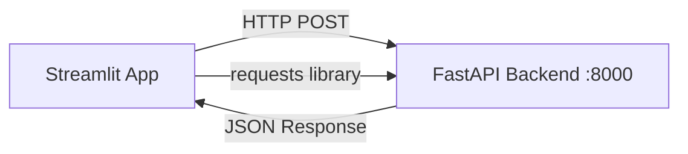

# Design — Frontend (Runbook Guardian)

## Arquitectura



Aplicación Streamlit de una sola página. Sin routing ni navegación compleja.

## Layout

```
┌─────────────────────────────────────────────────────┐
│  🛡️ Runbook Guardian                                │
│  Asistente seguro para equipos on-call              │
├─────────────────────────────────────────────────────┤
│                                                     │
│  [📝 Describe el incidente o síntoma...          ] │
│  [🔍 Consultar]                                    │
│                                                     │
├─────────────────────────────────────────────────────┤
│  ⚠️ BANNER: Modo fallback activo (si aplica)       │
├─────────────────────────────────────────────────────┤
│                                                     │
│  📄 Resultado 1                                     │
│  ┌─────────────────────────────────────────────┐   │
│  │ Fragmento de texto del runbook...            │   │
│  │                                              │   │
│  │ 📁 service-restart-nginx.md                  │   │
│  │ 🏷️ v1.2.0 | 📅 2026-07-01 | 📊 0.89       │   │
│  │ ⚠️ WARNING: Contiene acción destructiva      │   │
│  └─────────────────────────────────────────────┘   │
│                                                     │
│  📄 Resultado 2 ...                                 │
│                                                     │
├─────────────────────────────────────────────────────┤
│  ▶ Fuentes rechazadas (2)                          │
│    - doc-legacy.md: deprecated                      │
│    - old-process.md: sin revisión > 90 días         │
├─────────────────────────────────────────────────────┤
│  ⏱️ Respuesta en 245ms | 📚 5 candidatos evaluados │
└─────────────────────────────────────────────────────┘
```

## Componentes

| Componente | Archivo | Responsabilidad |
|-----------|---------|-----------------|
| Header | `app.py` | Título, descripción breve |
| Query Input | `app.py` | Text input + botón submit |
| Results Panel | `app.py` | Lista de cards con evidencia |
| Warning Badge | `app.py` | Indicador visual de acción destructiva |
| Rejected Panel | `app.py` | Expander con fuentes rechazadas |
| Status Bar | `app.py` | Tiempo de respuesta + metadata |
| Fallback Banner | `app.py` | Warning cuando mode=fallback |
| Error State | `app.py` | Mensaje de error de conexión |

## Comunicación con backend

```python
import requests

BACKEND_URL = "http://localhost:8000"

def query_backend(text: str) -> dict:
    response = requests.post(
        f"{BACKEND_URL}/api/v1/query",
        json={"query": text},
        timeout=10
    )
    response.raise_for_status()
    return response.json()
```

## Decisiones

| Decisión | Justificación |
|----------|---------------|
| Todo en `app.py` | MVP simple, < 200 líneas, no necesita modularización |
| Sin estado persistente | Cada query es independiente |
| requests sync | Streamlit no soporta async nativamente |
| Sin caché de resultados | Simplicidad para MVP |
